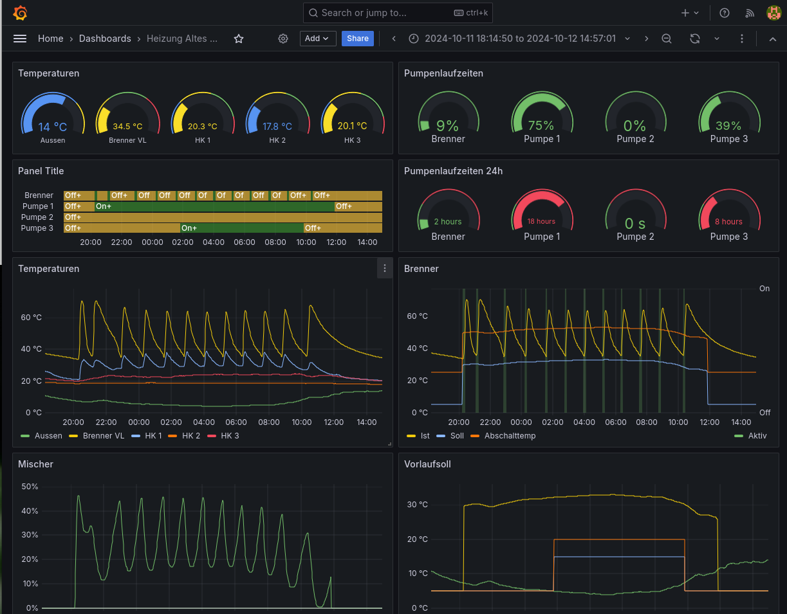

# UVRX2

## Prometheus-Exporter für Sensorwerten aus TA UVR x2 Heizungssteuerungen über CAN-Bus

### Zweck

Mit dieser Software können Sensor- und Konfigurationswerte aus einer UVRx2 Heizungssteuerung der 
Firma Technische Alternative direkt über einen CAN-Bus ausgelesen werden.
Dafür ist entsprechende CAN-Hardware nötig, die sehr preisgünstig erhältlich ist. 
Ein CMI-Modul ist dafür nicht notwendig. 

### Disclaimer

Disclaimer:
Diese Software ist kein Produkt der Firma "Technische Alternative" und hat keinerlei Freigabe oder Unterstützung dieser Firma. 
Diese Software dient Lernzwecken. Sie kann Schäden an ihrer Heizunganlage und in Folge darüber hinaus verursachen, für die niemand, insbesondere nicht ich, haften wird. Die Gefahr beim reinen Auslesen von Sensorwerten halte ich jedoch für gering. In meinen Experimenten, auch mit unfertigen Softwareständen, gab es nie irgendwelche Rückwirking auf die Funktion der Heizungssteuerung selbst. Ausschliessen kann ich das jedoch nicht.

### Basis

Basiert auf can/canopen library from Matthias Hochgatterer 
https://github.com/brutella/canopen
https://github.com/brutella/can
https://github.com/brutella/uvr

## Funktionalität:
Auslesen aller Mess- und Konfigurationswerte, die auch per CMI erreichbar sind.
Export nach prometheus, zur Überwachung und Visualisierung z.B. mittels grafana

Da es sich hier um Universal-Regler handelt, hängt die Interpretation der ausgelesenen Werte von der Programmierung ab. Die Werte aus der Programmierung muss von Hand übertragen werden. Das ist aktuell relativ fummelig. Wer es einfacher und zuverlässiger haben will, kauft am Besten das kommerzielle CMI-Modul.

## Hardware: 
Ich verwende
- Rasperry Pi Zero W2, ca €20
- Waveshare CAN-Hat, ca €10
- DC/DC Wandler zur Stromversorgung des Raspi direkt aus der UVR, ca €5
- Gehäuse, in die alle drei Komponenten nach Anpassung eingebaut werden können €5

## Unterstützte Steuerungen: 

Getestet ausschliesslich mit UVR 1610K. UVR16x2 sollte kompatibel sein, getestet wurde das jedoch nicht.

## Teaser


```
Device: HKR #1 Büro
	Betrieb                      : Zeit/Auto
	Betriebsart                  : Abgesenkt
	Vorlaufsolltemperatur        : 29.8 °C
	Vorlauftemperatur            : 26.7 °C
	Mischer 0 - 100%             : 14.3 %
	T.Raum Absenk                : 16 °C
	T.Raum Normal                : 20 °C
	Heizkurve Niveau             : 0 K
Device: HKR #2 Fussboden
	Betrieb                      : Standby/Frostschutz (#3)
	Betriebsart                  : Standby
	Vorlaufsolltemperatur        : 5 °C
	Vorlauftemperatur            : 26.9 °C
	Mischer 0 - 100%             : 0 %
	T.Raum Absenk                : 16 °C
	T.Raum Normal                : 20 °C
	Heizkurve Niveau             : 0 K
Device: HKR #3 Werkstatt
	Betrieb                      : Standby/Frostschutz (#3)
	Betriebsart                  : Standby
	Vorlaufsolltemperatur        : 5 °C
	Vorlauftemperatur            : 29.9 °C
	T.Raum Absenk                : 16 °C
	T.Raum Normal                : 20 °C
	Heizkurve Niveau             : 0 K
Device: Anforderung Heizung
	Anforderungstemp.            : 40.2 °C
	Solltemperatur Anforderung   : 29.8 °C
	Anforderung                  : Aus
Device: Eingänge
	T. Kessel VL                  : 40.2 °C
	T. Aussen                     : 7.2 °C
	T. HK VL 1                    : 26.7 °C
	T. HK VL 2                    : 26.9 °C
	T. HK VL 3                    : 29.9 °C
Device: Mischer 1
	Laufzeit                     : 00:02:05
Device: Pumpe #1
	Ausgangsstatus               : Ein
	Betriebsstunden              : 556:26:10
Device: Pumpe #2
	Ausgangsstatus               : Aus
	Betriebsstunden              : 48:11:57
Device: Pumpe #3
	Ausgangsstatus               : Aus
	Betriebsstunden              : 97:51:55
Device: Brenner
	Ausgangsstatus               : Aus
	Betriebsstunden              : 250:17:33
Device: Zeitprogramm
	Beginn                       : 07:40
	Ende                         : 17:00
Device: System
	Reglerstart                   : Aus
	Sensorfehler Eingang          : Nein
	Meldung                       : Aus
	Warnung                       : Aus
	Störung                       : Aus
	Fehler                        : Nein
```

## TODO

### Schreibzugriff

Das Format der Schreibzugriffe an die Steuerung konnte ich bisher nicht reverse-engineeren. In älteren Versionen muss das Kommando ein Schlüsselwort enthalten, welches hauptsächlich irrtümliches und zufälliges schreiben verhindern soll. Vermutlich ist das auch weiterhin so ähnlich gelöst, die Details kenne ich jedoch mangels Dokumentation nicht. Dazu wäre ein Belauschen des CAN-Busses während Schreibzugriffe notwendig.
Ich wäre froh, wenn dies jemand für mich erledigen könnte, oder mir für eine begrenzte Zeit ein CMI-Modul zur Verfüngung stellt. 

### MQTT Unterstützung 

Lesend/Schreibend

